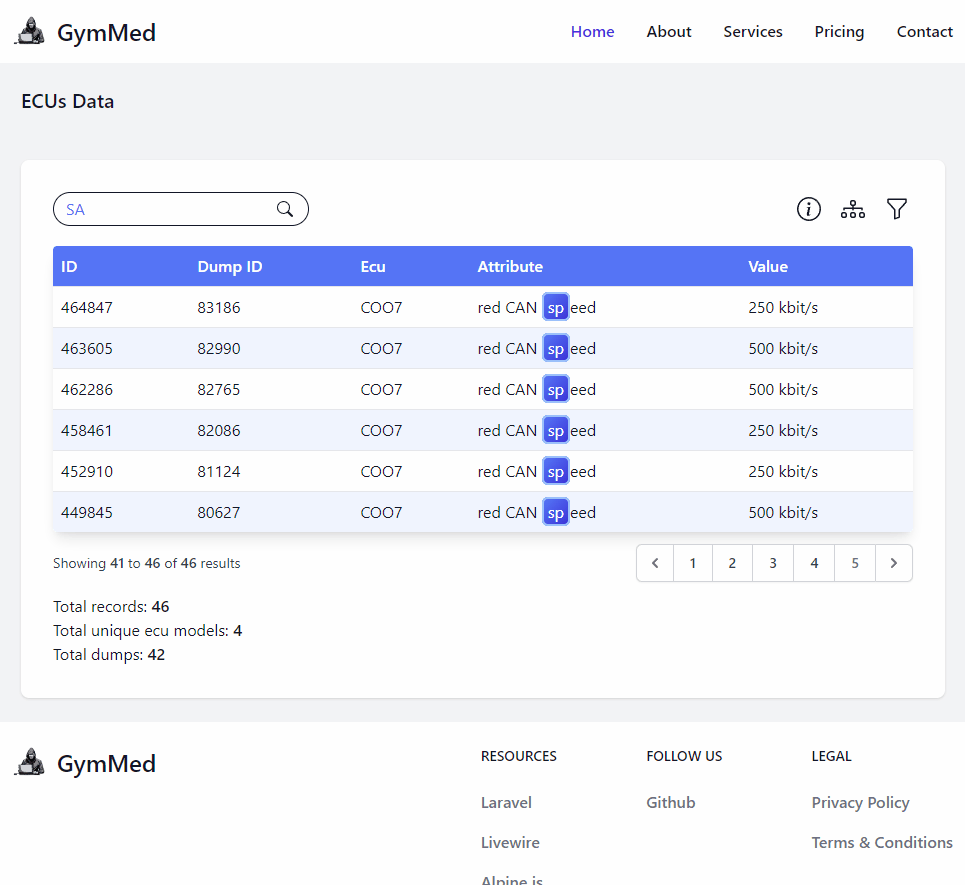

<h1 align="center">
    ECUs filtering system with charts
</h1>
 

  <!--   -->
   
  

  
    <a href="./preview">More Project Views</a>

## Welcome!

### Prerequisites

-   [Laravel (v11.5.0 or later)](https://laravel.com/docs/11.x/upgrade#updating-dependencies)
-   [MySQL (v5.7 or later)](https://laravel.com/docs/11.x/database#introduction)
-   NPM or Yarn installed

# 1. How to launch this project

**[✔] 1.1 Add `.env` file**

-   Create a new file named `.env` in the project root directory.

-   To do it propertly copy this code and paste it to your newly created .env file(provided .env example document).

**[✔] 1.2 Install dependencies**

-   Run `composer install` in the root directory to install the required packages.
-   Run `npm install` in the root directory to install the required packages.

**[✔] 1.3 Migrate and seed database**

-   Run `php artisan migrate:fresh --seed` in the root directory to create tables and seed them with data from excel.

**[✔] 1.4 Launch the project**

-   Use `php artisan serve` to start backend on localhost.
-   Use `npm run dev` to watch style changes.
